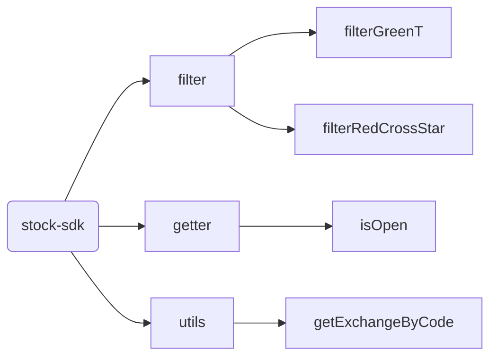

```mermaid
graph LR
    root(stock-sdk) --> filter
    root --> getter
    root --> utils

    filter --> filterGreenT
    filter --> filterRedCrossStar

    getter --> isOpen

    utils --> getExchangeByCode
```
